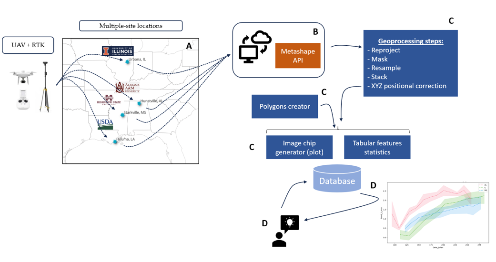

<h1 style="text-align: center;">'pyAerialExtractor' A GEOSPATIAL TOOLBOX FOR PROCESSING VERY-HIGH-SPATIAL RESOLUTION AERIAL IMAGERY OVER AGRONOMIC AND BREEDING TRIALS</h1> 

-------
-------

This is a sequence of Python scripts that allow to semi-automatically process large volumne of plot-level metrics from DJI P4 UAV datasets (orthomosaics and CSM tifs) in the 
context of agronomic and breeding trials. This is an evolving process and the plan is to make it flexible enough to process any kind of aerial imagery regardless of the UAV or sensor dealing with shortly.

The story of this started as part of a collaboratory regional nextwork among bioenergy breeders and agronomists willing to better understand the seasonal dynamics of these crops under different environment conditions in US.

The following diagram describes a summary of the steps involved in the processing of the datasets:

-------
-------

  

The process starts with the implementation of Metashape API Professional Edition in a BioCluster located at the Institie for Genomic Biology (IGB) at the University of Illinois Urbana-Champaign. This py script enables to automate 
the Metashape processing steps of the original imagery collected with the UAV flights at different locations preventing to use the interactive traditional GUI interface of the software which can be a limitation for processing large number 
of flights over the growing season of the crops.

------
------

*Reproject Tool* 

The tool was desinged as early step for checking and reprojecting if needed tif files generated in Metashape API and vector shapefiles under EPSG:3246 (spherical coordindates system) into planar coordindate systems e.g., EPSG:32616 (Illinois) 
given that planar features calculation is going to be produced in the following steps.

The following parameters should be provided in the tool as function arguments in the command line: (relative input folder path for shps, relative output folder path for shps, relative input folder path for tifs, relative output folder path for tifs, 
output target coordindate system).

